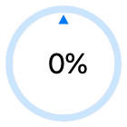
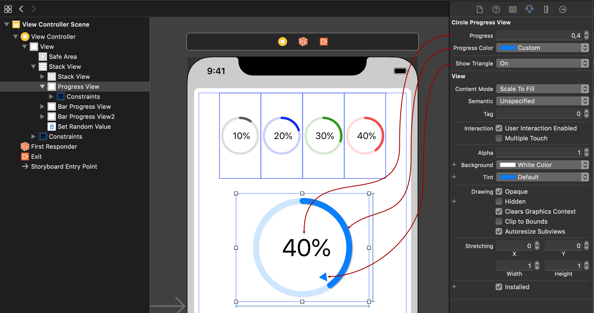
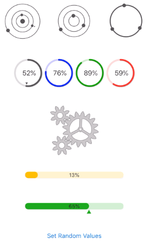

<p align="center">
   
</p>

<p align="center">
   <a href="https://developer.apple.com/swift/">
      
   </a>
<!--<a href="http://cocoapods.org/pods/ShowSomeProgress">
      
   </a>
   <a href="http://cocoapods.org/pods/ShowSomeProgress">
      
   </a>
-->
   <a href="https://github.com/Carthage/Carthage">
      
   </a>
   <a href="https://github.com/apple/swift-package-manager">
      
   </a>
</p>

<p align="center">
Progress Indicators and Activity Views for iOS Apps
</p>

## Features

- [x] Storyboard compatible, configure apprearance with the property inspector.
- [x] fully animated, just set a new progress value and the view will update itself smoothly

## Currenty Implemented Progress Indicators

`CircleProgressView` - A circular indicator



`BarProgressView` - A bar indicator


### Configurable properties:
* `progress` - progress value - 0.0 - 1.0
* `progressColor` - UIColor of the progress indicator
* `showTriangle` - Bool, selects visibility of the small triangle 

## Currently Implemented Activity Indicators

`OrbitActivityIndicatorView` - Shows a simplifed planetary system during Activity 


`OrbitActivityIndicatorView2` - Shows a planetary system during Activity 


`OrbitActivityIndicatorView3` - Shows chasing dots system during Activity 


`GearActivityIndicatorView` - Shows three gears during Activity 


### Configurable properties:
* `tintColor` - color of the view

## Usage



Just import the framework and use the views like you would use `UIProgressView`

```swift
import UIKit
import ShowSomeProgress

class ViewController: UIViewController {

  @IBOutlet weak var circleProgressView: CircleProgressView!

  @IBAction func setRandomValueTapped(_ sender: Any) {
    circleProgressView.progress = CGFloat(Double.random(in: 0...1))
  }
}  
```

## Example

The example application is the best way to see `ShowSomeProgress` in action. Simply open the `ShowSomeProgress.xcodeproj` and run the `Example` scheme.




## Installation
<!--
### CocoaPods

ShowSomeProgress is available through [CocoaPods](http://cocoapods.org). To install
it, simply add the following line to your Podfile:

```bash
pod 'ShowSomeProgress'
```
-->

### Carthage

[Carthage](https://github.com/Carthage/Carthage) is a decentralized dependency manager that builds your dependencies and provides you with binary frameworks.

To integrate ShowSomeProgress into your Xcode project using Carthage, specify it in your `Cartfile`:

```ogdl
github "stoneburner/ShowSomeProgress"
```

Run `carthage update` to build the framework and drag the built `ShowSomeProgress.framework` into your Xcode project. 

On your application targets’ “Build Phases” settings tab, click the “+” icon and choose “New Run Script Phase” and add the Framework path as mentioned in [Carthage Getting started Step 4, 5 and 6](https://github.com/Carthage/Carthage/blob/master/README.md#if-youre-building-for-ios-tvos-or-watchos)

### Swift Package Manager

To integrate using Apple's [Swift Package Manager](https://swift.org/package-manager/), add the following as a dependency to your `Package.swift`:

```swift
dependencies: [
    .package(url: "https://github.com/stoneburner/ShowSomeProgress.git", from: "1.0.0")
]
```

### Manually

If you prefer not to use any of the aforementioned dependency managers, you can integrate ShowSomeProgress into your project manually. Simply drag the `Sources` Folder into your Xcode project.

## Contributing
Contributions are very welcome 🙌

## License

```
ShowSomeProgress
Copyright (c) 2019 ShowSomeProgress alexander@kasimir.at

Permission is hereby granted, free of charge, to any person obtaining a copy
of this software and associated documentation files (the "Software"), to deal
in the Software without restriction, including without limitation the rights
to use, copy, modify, merge, publish, distribute, sublicense, and/or sell
copies of the Software, and to permit persons to whom the Software is
furnished to do so, subject to the following conditions:

The above copyright notice and this permission notice shall be included in
all copies or substantial portions of the Software.

THE SOFTWARE IS PROVIDED "AS IS", WITHOUT WARRANTY OF ANY KIND, EXPRESS OR
IMPLIED, INCLUDING BUT NOT LIMITED TO THE WARRANTIES OF MERCHANTABILITY,
FITNESS FOR A PARTICULAR PURPOSE AND NONINFRINGEMENT. IN NO EVENT SHALL THE
AUTHORS OR COPYRIGHT HOLDERS BE LIABLE FOR ANY CLAIM, DAMAGES OR OTHER
LIABILITY, WHETHER IN AN ACTION OF CONTRACT, TORT OR OTHERWISE, ARISING FROM,
OUT OF OR IN CONNECTION WITH THE SOFTWARE OR THE USE OR OTHER DEALINGS IN
THE SOFTWARE.
```
